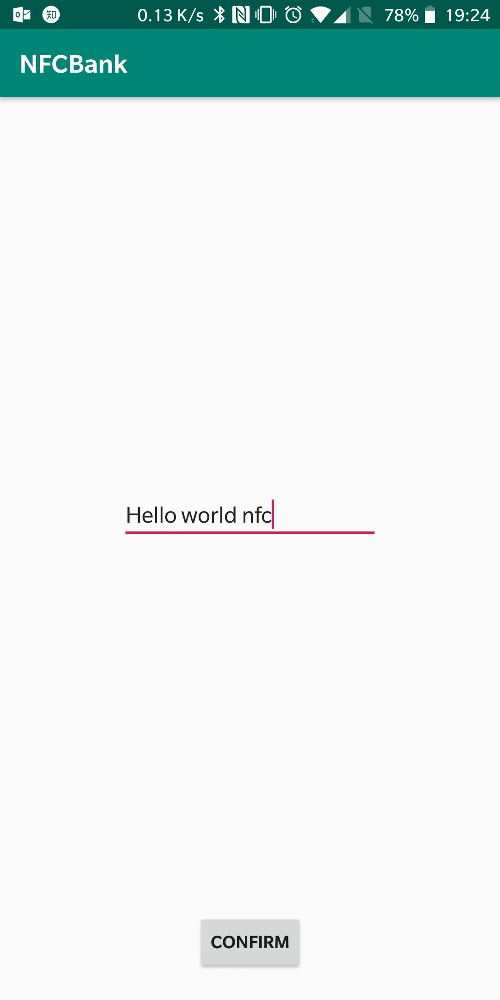
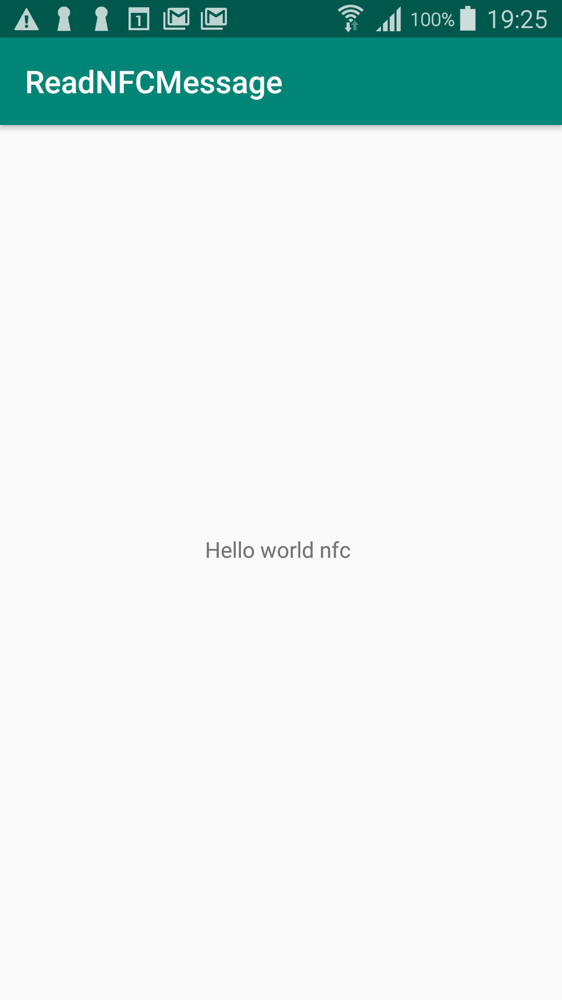
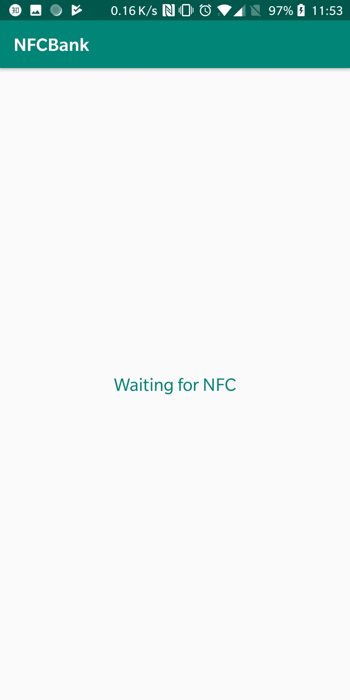
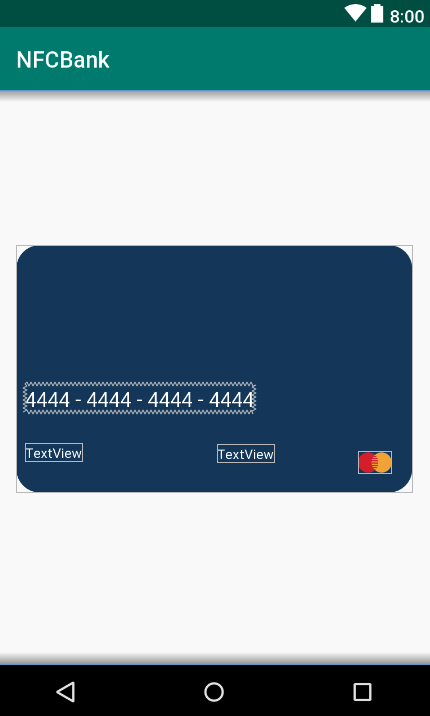

# Introduction
This is a experimental project about Android NFC functionality. The whole idea is based on using android device as
a [Host Card Emulation](https://developer.android.com/guide/topics/connectivity/nfc/hce), however we cannot simply send
a byte array by realising communication enter iOS and Android because of iOS can only accept `NDEF Message`. So I'm enlightened by reading [NFCForum-TS-Type-4-Tag](http://apps4android.org/nfc-specifications/NFCForum-TS-Type-4-Tag_2.0.pdf)
which simulate the whole process command talking cross devices. You can find more details by reading [this documentation](http://apps4android.org/nfc-specifications/NFCForum-TS-Type-4-Tag_2.0.pdf).

## Architecture
The whole project conclude 3 projects modules globally.

        |       Module      |                           Status                         |
        |:-----------------:|:--------------------------------------------------------:|
        |      app          |    Android Host Card Emulation of a NFC Forum Type-4 tag |
        |  readNfcMessage   |    NFC Read Application to verify HCE Android Completion |
        |    nfcemvread     |    NFC Read Application to get Card Bank Information     |

## ScreenShots

 - Android HCE with NFC Type-4 Tag
 

- read NFC Message Application
    - Android
    - 
    - iOS
    - 

- nfc read card bank info (EMV)
    -  

## Ref
- https://developer.android.com/guide/topics/connectivity/nfc/hce
- https://manijshrestha.wordpress.com/2014/07/23/using-android-beamnfc-to-transfer-data/
- https://www.jianshu.com/p/e89cc9bba8a6

## Beam Transfer
- https://blog.csdn.net/lepaitianshi/article/details/50540595
- https://github.com/PGzxc/NFCFile
- https://github.com/PGzxc/NFCBeam
- https://www.jianshu.com/p/42be304ac616